# Introducción a conceptos de Simulación de Eventos Discretos (DES)
---

La **Simulación de Eventos Discretos (DES, por sus siglas en inglés)** es un enfoque de modelado de simulación para representar procesos secuenciales en los que las “cosas” (entidades) atraviesan una serie de pasos que consumen recursos. Es especialmente útil en sistemas de **servicio** donde, con frecuencia (aunque no siempre), hay personas u objetos **esperando** por uno o varios servicios.

En una simulación de eventos discretos, las **entidades** fluyen (y hacen **cola**) a través de procesos secuenciales que usan **recursos**. Las colas pueden ser **físicas** (personas esperando de pie) o más **abstractas** (personas en una lista de espera para una cita, resultados de laboratorio esperando verificación, etc.).

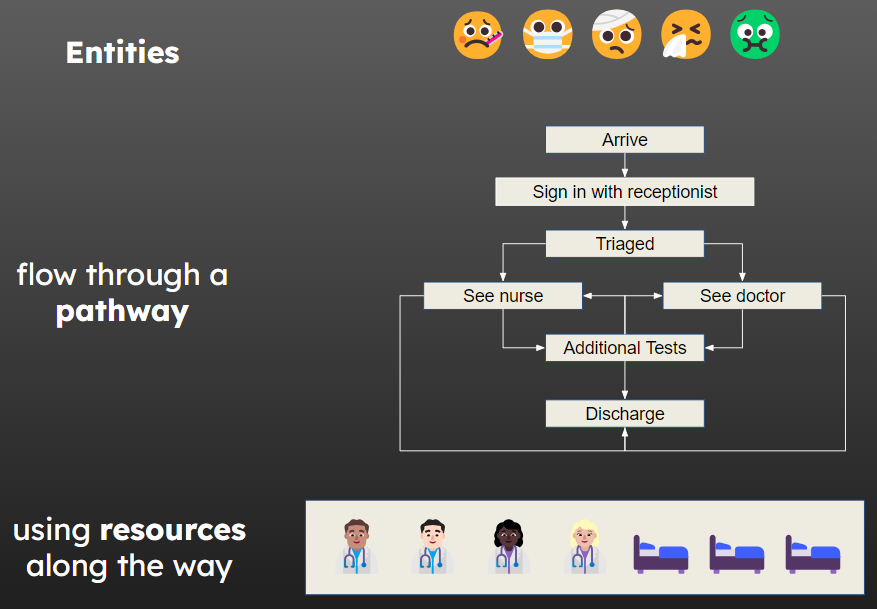

En salud, los modelos DES se pueden usar para modelar, por ejemplo:

- Rutas de atención de pacientes.
- Sistemas telefónicos.
- Requerimientos.
¡Y otros!

Los modelos DES son extremadamente útiles para responder **preguntas de “qué pasaría si…?”** sobre cambios en procesos o rutas.

## ¿Por qué usar DES?

La simulación de eventos discretos te permite:

- Probar cambios **sin riesgo** y a **bajo costo**.
- Explorar el **impacto de variaciones en la demanda**.
- Evaluar si el sistema **aguanta días malos** además de los buenos.
- **Predecir** cuánto tomará **despejar un backlog** existente.

Esto puede ayudarte a **optimizar** un sistema, logrando **mejor equilibrio y flujo**, lo que a su vez puede conducir a:

- Un **entorno más seguro**.
- **Menos estrés** para el personal.
- **Mejor experiencia** para los pacientes.
- **Cumplimiento** de metas y estándares.

## Un ejemplo

Imagina poder crear un modelo de un **servicio de urgencias** (ED).

En ese modelo, podrías cambiar muchas cosas:

- Cuántos **médicos**, **enfermeras** y **recepcionistas** hay en cada etapa.
- Cuánto **tarda** cada persona en ser atendida.
- Qué proporción de personas entra a la **ruta de trauma** frente a la **no traumática**.

Luego, añade una **dosis de aleatoriedad**: en la vida real, **no** todas las atenciones duran exactamente lo mismo, **no** llegan pacientes a intervalos regulares y **no** ocurren los mismos sucesos cada día. Ejecuta el modelo para **muchos días simulados aleatorios** y observa cómo se comporta en **días buenos y días malos**.

Finalmente, puedes **visualizar** a las entidades moviéndose por el sistema y **compartir** el modelo con quienes deciden, de modo que exploren por sí mismos el impacto de los cambios.

<iframe src="https://github.com/hsma-programme/Teaching_DES_Concepts_Streamlit/assets/29951987/1adc36a0-7bc0-4808-8d71-2d253a855b31" width="480" height="270" frameBorder="0" class="giphy-embed" allowFullScreen></iframe>

## Ejecuciones y ensayos

Un **modelo estocástico** incorpora **aleatoriedad y variabilidad**. Cada **ejecución** del modelo toma **muestras aleatorias** para tiempos entre llegadas, duraciones de actividades y otras variables clave. Eso nos permite capturar un **rango** de escenarios posibles y obtener **conclusiones más robustas**.

¿Qué pasa si en una ejecución se muestrean **tiempos de actividad inusualmente largos**? ¿O **tiempos entre llegadas inusualmente largos**?

Necesitamos correr una **simulación estocástica muchas veces** y **resumir los resultados** de todas esas ejecuciones para tener salidas representativas del modelo.

- Una **ejecución** es correr el modelo por un periodo de tiempo simulado con un conjunto de semillas aleatorias.
- Un **ensayo** es un conjunto de **múltiples ejecuciones** con los **mismos parámetros** (por ejemplo, 100 ejecuciones con igual configuración).

## Terminología clave de DES

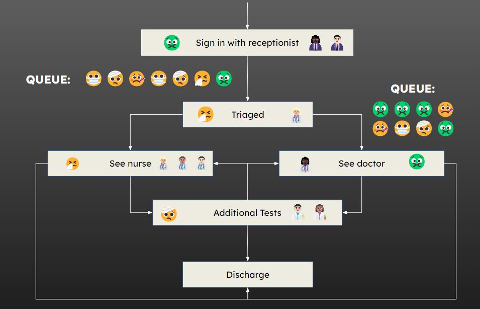

### Entidades (Entity)

Las **entidades** son los “objetos” que fluyen por los procesos secuenciales del sistema modelado (por ejemplo, **pacientes**, **clientes**, **requerimientos**, **llamadas** a un call center).

Cada entidad puede tener ciertos **atributos** que “lleva consigo” y que **determinan su recorrido** a través del sistema, por ejemplo:

- Si va por el **camino A** o por el **B**.
- **Cuánto tiempo** pasa en una actividad.
- Su **prioridad** en una cola.

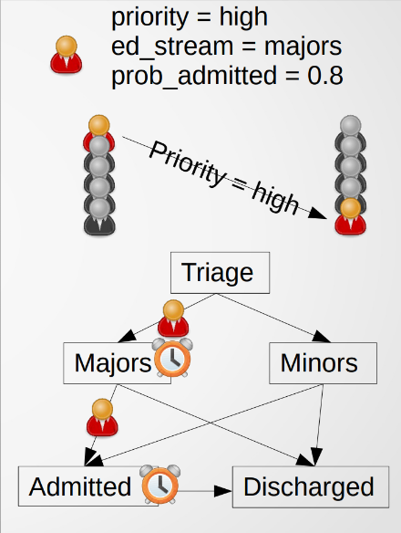

### Generadores e interllegadas

Un **generador** crea **nuevas entidades** que entran al sistema. La **frecuencia** con la que se generan nuevas entidades está determinada por un **tiempo entre llegadas** (**inter-arrival time**).

El **tiempo entre llegadas** especifica cuánto hay entre la generación de una entidad y la generación de la siguiente.

Los tiempos entre llegadas pueden ser **fijos**, pero típicamente se **muestrean aleatoriamente** de una **distribución** para capturar la **variabilidad** (aunque sea pequeña).

Con frecuencia se usa la **distribución exponencial** para muestrear **tiempos entre llegadas**. A menudo hay **más de un generador** en un sistema (por ejwmplo, llegada de pacientes en ambulancia, por cuenta propia, remitidos por APS).

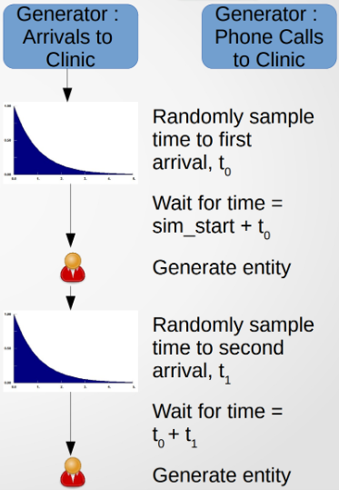

### Colas

Cada **actividad** en una DES tiene una **cola** asociada: ahí **esperan** las entidades mientras la actividad se vuelve disponible para ellas.

Cada cola tiene una **política de encolamiento**, que determina el **orden** en que las entidades salen de la cola hacia la actividad. Las dos políticas más comunes son:

- **FIFO (First In, First Out)**: se atiende en el orden de llegada (**predeterminada**).
- **Basada en prioridad**: se atiende según un **atributo de prioridad**; los empates suelen resolverse con FIFO.

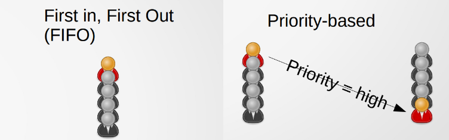

### Actividades y tiempos de actividad

Cada **actividad** en una DES describe un **proceso** —que puede ser una tarea simple o un **conjunto de tareas**. Para que una actividad se ejecute, se necesita:

- Una **entidad** (tomada de la cola).
- El **tipo** y **número** requerido de **recursos** disponibles.

Una vez que se cumplen estas condiciones, la **actividad inicia**. La entidad y los recursos quedan **ocupados** durante un **tiempo de actividad**; esos recursos **no** pueden utilizarse en otro lugar hasta que dicho tiempo **finalice**.

Los **tiempos de actividad** pueden ser **fijos**, pero típicamente se **muestrean estocásticamente** de una **distribución**.

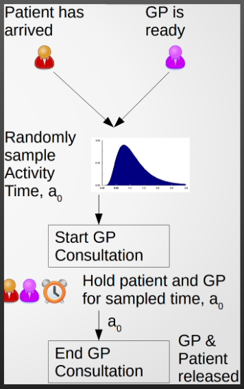

::: {.callout-tip}
Una distribución común para **tiempos de proceso** es la **log-normal**. Sin embargo, la **exponencial** puede ser un **buen punto de partida**, pues es sencillo **ajustar la media** mientras se explora el modelo y, más adelante, cambiar a algo como una **log-normal** cuando tú (y las personas interesadas) estén conformes.
:::

### Recursos

Los **recursos** son necesarios para llevar a cabo actividades. Una actividad puede requerir **uno o varios recursos del mismo tipo**, o **múltiples recursos de distintos tipos**.

::: {.callout-tip}
Algunas actividades **no** requieren un recurso explícito; pero piensa con cuidado si **vale la pena modelarlo**: si un recurso **no impone restricción**, probablemente **no** deba modelarse.
:::

Los recursos pueden incluir:
- **“Personal”** (p. ej., médicos, enfermeras, agentes, docentes).
- **“Cosas”** (p. ej., camas, equipos de prueba, salas, celdas).

Los recursos suelen **compartirse** en el sistema, por lo que una **alta demanda** en un punto puede **afectar** a otro. **Todos** los recursos requeridos deben estar disponibles para que la actividad se lleve a cabo.

En algunas actividades, contar con **recursos adicionales opcionales** puede **acelerar** la actividad (aunque **raramente** de forma lineal).

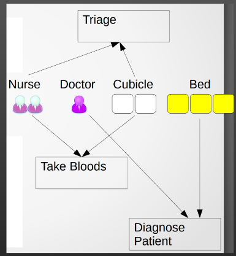

### Sumideros (Sinks)

Los **sumideros** son la forma en que las entidades **salen** del sistema (o de una **parte** del sistema) modelado. Un sumidero puede representar, por ejemplo:

- Una entidad que **sale físicamente** del sistema (p. ej., alta hospitalaria).
- Una entidad que **deja de existir** (p. ej., fin de una llamada telefónica, uso completo de una muestra).
- Una entidad que ya **no necesita** acceder a las actividades de interés (p. ej., deja la parte del sistema que estamos modelando).

Lo más importante al pensar en un **sumidero** es que **no necesariamente** implica que la entidad **abandone todo el sistema**; puede significar que **sale del alcance** de nuestro modelo.

Por ejemplo, si el **alcance** de tu modelo solo cubre **triaje y evaluación inicial**, un sumidero puede colocarse **después del triaje**: el paciente salió del **alcance** del modelo, aunque **siga** en el hospital.

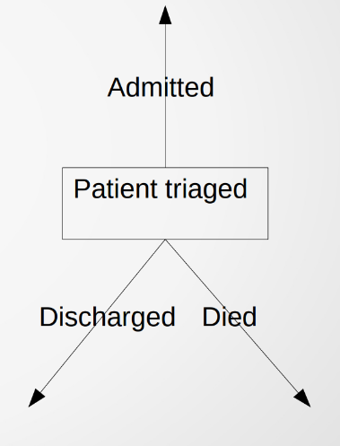

### Ramas (caminos alternativos)

Los sistemas reales (y sus modelos) **raramente** son una única línea. Con frecuencia hay **ramificaciones** que envían a distintas entidades a **diferentes actividades** o a **diferentes sumideros**.

Podemos diferenciar/ramificar con base en:

- Un **atributo** de la entidad (p. ej., pacientes con **mayor prioridad** pasan por un conjunto distinto de actividades).
- **Probabilidad** (p. ej., sabemos que ~**60%** de cierto tipo de pacientes se **ingresan**; elegimos aleatoriamente ingresarlos el **60%** de las veces).
- **Tiempo** (p. ej., después de cierta **hora del día**, las entidades fluyen por un conjunto distinto de actividades).

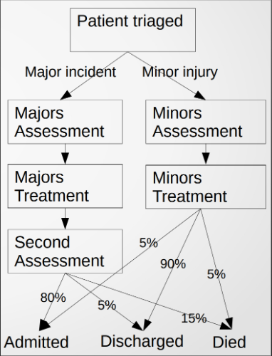

### Salidas (outputs)

Como en cualquier modelo, es importante pensar **qué salidas** te interesan. Salidas típicas de un modelo DES incluyen (promedio, mínimo, máximo, **percentil** \(p. ej., p90, p95\)) de:

- **Tiempo en el sistema** por entidad.
- **Longitud** de cola y **tiempo en cola** para colas de interés.
- **Utilización de recursos** (proporción del tiempo en que un recurso está ocupado).
- **Probabilidad** de exceder un umbral definido de longitud/tiempo de cola o de **capacidad** (p. ej., espera de 4 horas en urgencias, umbrales de sobreocupación).

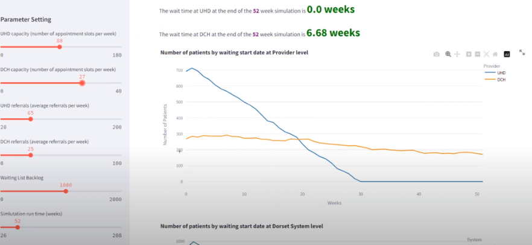

---

## Ejercicio — Diseñar una DES

Diseña una **Simulación de Eventos Discretos (DES)** para un sistema de tu elección.

Piensa en distintas posibilidades (¡no tienen que ser de salud; pueden ser de lo que sea! ¿Un restaurante? ¿Un aeropuerto? ¿Una línea de atención al cliente?).

Luego, elabora el **diseño del modelo**. Esto debe incluir:

- Las preguntas de **“¿qué pasaría si…?”** que usarías el modelo para responder.
- Un **mapa de procesos** del sistema que quieres modelar.
- Un **modelo conceptual** para la DES propuesta (que puede no incluir todo lo que aparece en el mapa de procesos).

Identifica los tipos de **entidades**, **generadores**, **actividades**, **colas**, **recursos** y **sumideros** (*sinks*).

Describe qué representan tus **tiempos entre llegadas** (*inter-arrival times*) y **tiempos de actividad**, y de **dónde podrías obtener los datos** para parametrizarlos.

Considera el **alcance**, el **nivel de detalle**, etc., al diseñar tu modelo. ¿Qué necesitas modelar para responder tu(s) pregunta(s)? ¿Cómo puedes **simplificar** tu modelo?

---
# Una introducción a SimPy

**SimPy** es un paquete de Python que nos permite crear potentes modelos de **Simulación de Eventos Discretos (DES)**.

Puedes leer los tutoriales y las guías de referencia de SimPy en su sitio web (<https://simpy.readthedocs.io/en/latest/>), pero te recomendamos trabajar primero al menos los primeros capítulos de este libro.

> Para instalar SimPy, necesitamos ejecutar `pip install simpy`. Sin embargo, se recomienda usar un **entorno** separado. Asegúrate de **cambiar** a ese entorno para cualquier trabajo de DES que hagas —o, mejor aún, configura un entorno separado para **cada proyecto** de DES que emprendas.

Antes de ver cómo armamos un modelo en SimPy, hay un par de conceptos importantes que debemos cubrir primero.

## Tiempo de simulación

Las simulaciones en SimPy se ejecutan en **unidades de tiempo**. Estas unidades pueden representar cualquier cantidad de tiempo del mundo real que deseemos, siempre y cuando seamos **consistentes dentro del mismo modelo**.

Nuestras unidades de tiempo deben representar el **nivel más bajo** de tiempo real que necesitamos en el modelo. En modelos de **rutas** donde personas llegan para un servicio, esto probablemente serán **minutos** (segundos es demasiado, y horas probablemente no sea suficiente, a menos que todos los procesos sean lentos). Pero podríamos tener rutas donde el tiempo se mida en **días o semanas** (p. ej., rutas de remisión).

Por ejemplo, en un modelo de **servicio de urgencias (ED)**, nuestras unidades de tiempo pueden representar **minutos**. Entonces especificamos todo en **minutos**: tiempos entre llegadas, tiempos de actividad, etc.

> En sentido estricto, SimPy **no avanza** en unidades de tiempo fijas. En su lugar, **programa eventos** y **salta** al siguiente. Sin embargo, no necesitas preocuparte por eso. Solo ten en cuenta que, como resultado, el **tiempo de simulación** se representa como **números de punto flotante** (p. ej., el tiempo actual podría ser 3.6).

## Funciones generadoras

SimPy se basa en un tipo especial de función en Python conocido como **función generadora** (*Generator Function*).

Veamos lo que entendemos por una **función generadora**.

Las funciones convencionales en Python se **llaman**, luego **se ejecutan** con algunas (opcionales) entradas y **terminan** (usualmente **devolviendo** alguna salida). Cuando volvemos a llamar la función, esta se ejecuta de nuevo, **desde cero**.

Las **funciones generadoras** recuerdan dónde estaban y qué hicieron cuando el control les fue devuelto (es decir, **mantienen su estado local**), de modo que **pueden continuar** donde se quedaron y pueden usarse como **iteradores** potentes (los bucles `for` y `while` son otros ejemplos de iteradores).

Esto es muy útil cuando queremos **conservar estado**, para recordar **cuánto falta** para generar la **siguiente entidad** o **en qué parte** de una ruta está una entidad…

Veamos un ejemplo muy simple de una **función generadora** para observar cómo funcionan.

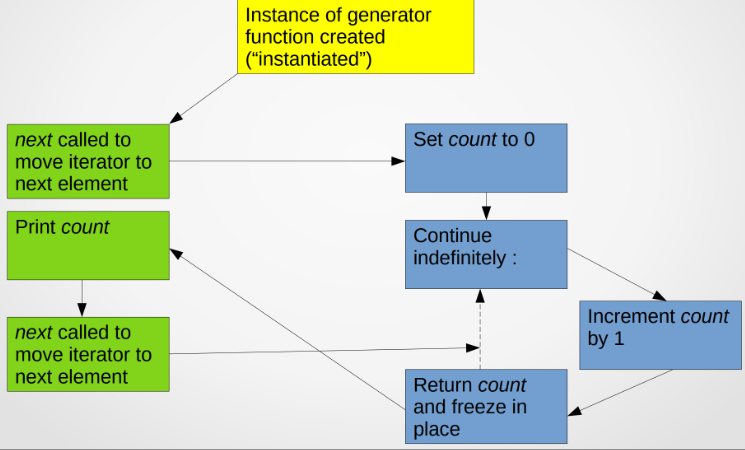

En SimPy, usamos **funciones generadoras** en dos lugares:

1. **Para modelar los generadores de la DES (puntos de llegada).**
2. **Para modelar el recorrido individual de cada entidad.**

Imaginemos que estamos modelando **pacientes** en una ruta de atención.

Para **1. Modelar los generadores de la DES (puntos de llegada):** la función generadora básicamente **crea un paciente**, lo **pone en marcha** en su ruta y luego **se congela** durante un tiempo que representa el **tiempo entre llegadas** hasta el siguiente paciente. Después, **repite** el proceso.

Para **2. Modelar el recorrido individual de cada entidad:** la función generadora **solicita un recurso** y **se congela** hasta que ese recurso esté disponible (**la cola**). Cuando el recurso está disponible, **permanece** un **tiempo** con él (**la actividad**). Luego **avanza** a la **siguiente actividad** (y solicita el recurso para ella, como arriba) o **finaliza** si no hay más actividades.

